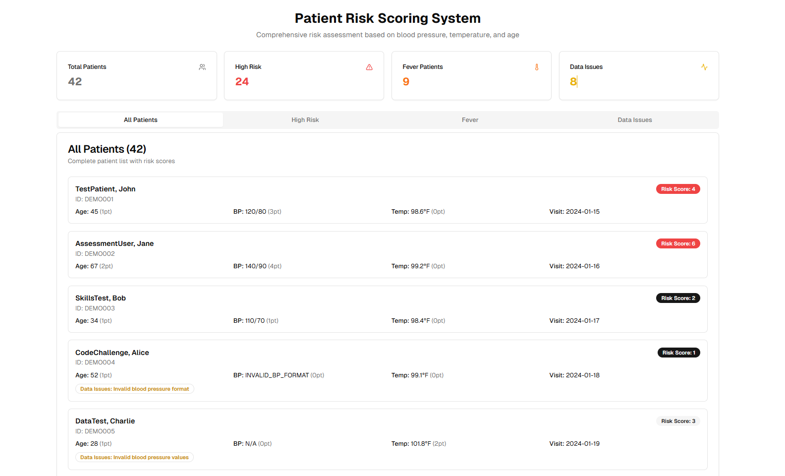

# Patient Risk Scoring System

This project implements a robust Patient Risk Scoring System designed to assess patient risk based on key health indicators: Blood Pressure, Temperature, and Age. It integrates with a simulated real-world API, handling common challenges like inconsistent response formats, rate limiting, and intermittent failures. The system calculates individual risk scores for each patient and identifies high-risk patients, fever patients, and data quality issues.

## 📸 UI Preview



## Features

*   **Comprehensive Risk Scoring**: Calculates a total risk score based on detailed criteria for Blood Pressure, Temperature, and Age.
*   **API Integration with Resilience**:
    *   Fetches patient data from a paginated API.
    *   Implements retry logic with exponential backoff for 429 (Rate Limit) and 5xx (Server Error) responses.
    *   Handles inconsistent API response formats (`data` vs. `patients` arrays, different pagination fields).
    *   Provides progress tracking during data fetching.
*   **Alert Lists**:
    *   **High-Risk Patients**: Identifies patients with a total risk score of 4 or higher, *excluding* those with data quality issues for reliable assessment.
    *   **Fever Patients**: Flags patients with a temperature of 99.6°F or higher.
    *   **Data Quality Issues**: Lists patients with missing or malformed data in critical fields (BP, Temperature, Age).
*   **User-Friendly Interface**:
    *   Dashboard with key statistics (Total Patients, High Risk, Fever, Data Issues).
    *   Tabbed navigation for easy access to different patient lists.
    *   Detailed patient cards displaying individual scores and data issues.
    *   Clear loading and error states with retry options.
    *   Reference section for risk scoring criteria.
*   **Modular and Maintainable Codebase**: Follows best practices for Next.js (App Router) and React, with a well-organized folder structure for scalability and readability.

## API Information

The system interacts with a simulated API that exhibits real-world behaviors:

*   **Base URL**: `https://assessment.ksensetech.com/api`
*   **Authentication**: Requires `x-api-key` header. The API key is hardcoded in `constants/api.ts` for this demonstration.
*   **Rate Limiting**: May return 429 errors.
*   **Intermittent Failures**: Approximately 8% chance of 500/503 errors.
*   **Pagination**: Returns 5 patients per page by default.
*   **Inconsistent Responses**: Data format may vary between requests.

## Folder Structure

The project is organized into a modular and maintainable structure:

```
.
├── app/
│   └── page.tsx             # Main application page, orchestrates components and hooks
├── components/
│   ├── dashboard/
│   │   ├── scoring-criteria.tsx # Displays the risk scoring rules
│   │   └── stats-cards.tsx      # Displays summary statistics
│   ├── patients/
│   │   ├── alert-list.tsx       # Reusable component for displaying alert lists (high-risk, fever)
│   │   ├── data-issues-list.tsx # Displays patients with data quality issues
│   │   ├── empty-state.tsx      # Generic empty state component
│   │   ├── patient-card.tsx     # Displays individual patient details and scores
│   │   └── patient-list.tsx     # Generic list component for all patients
│   └── ui/                      # Shadcn/ui components (button, card, tabs, progress, alert)
│       ├── error-card.tsx       # Displays error messages with retry option
│       └── loading-card.tsx     # Displays loading progress
├── constants/
│   └── api.ts                   # API configuration, risk thresholds, and scoring criteria
├── hooks/
│   └── usePatients.ts           # Custom React hook for fetching and processing patient data
├── services/
│   └── api.ts                   # API service for fetching data with retry logic and response normalization
├── types/
│   └── patient.ts               # TypeScript interfaces for patient data and API responses
└── utils/
    ├── filters.ts               # Utility functions for filtering patient lists (high-risk, fever, data issues)
    └── scoring.ts               # Utility functions for calculating individual risk scores
```

## How to Run the Application

This project uses Next.js with the App Router and pnpm as the package manager.

1.  **Clone the repository (if applicable):**
    ```bash
    git clone <your-repo-url>
    cd patient-risk-scoring
    ```

2.  **Install dependencies:**
    ```bash
    pnpm install
    ```

3.  **Run the development server:**
    ```bash
    pnpm dev
    ```

    The application will be accessible at `http://localhost:3000`.


## Troubleshooting

*   **Varying Patient Count**: Due to the simulated API's intermittent failures and rate limiting, the total number of patients displayed might vary slightly on each refresh. The system includes retry logic and logs warnings if data is missing.
*   **API Key**: Ensure the API key in `constants/api.ts` is correct.
*   **Network Issues**: If you encounter persistent errors, check your internet connection or the API's availability.
